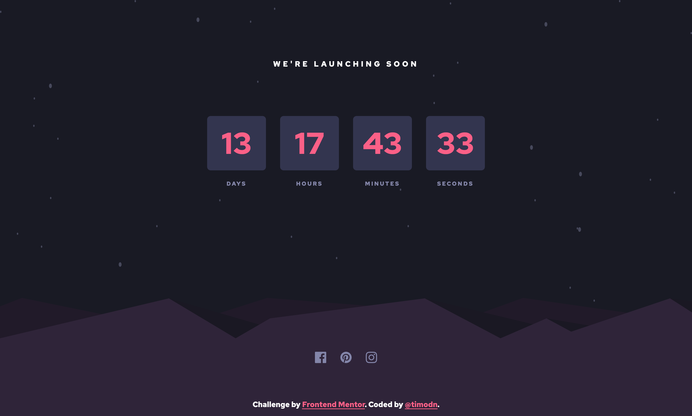

# Frontend Mentor - Launch countdown timer solution

This is a solution to the [Launch countdown timer challenge on Frontend Mentor](https://www.frontendmentor.io/challenges/launch-countdown-timer-N0XkGfyz-). Frontend Mentor challenges help you improve your coding skills by building realistic projects. 

## Table of contents

  - [The challenge](#the-challenge)
  - [Screenshot](#screenshot)
  - [Links](#links)
  - [Built with](#built-with)
  - [What I learned](#what-i-learned)
  - [Continued development](#continued-development)
- [Author](#author)

### The challenge

Users should be able to:

- See hover states for all interactive elements on the page
- See a live countdown timer that ticks down every second (start the count at 14 days)
- **Bonus**: When a number changes, make the card flip from the middle

### Screenshot

### Links

- Solution URL: []
- Live Site URL: []

### Built with

- HTML
- CSS custom properties
- Javascript

### What I learned

I had no idea that the number cards were supposed to be made from pure html and css and that this challenge would be a difficult one for me. Since I have not learned any advanced CSS usages, I couldn't complete the bonus one. So, I did as far as what I knew what to do to tackle this challenge.

### Continued development

I would love to learn and do more challenges to improve my CSS skills. 

## Author

- Frontend Mentor - [@timodn](https://www.frontendmentor.io/profile/timodn)